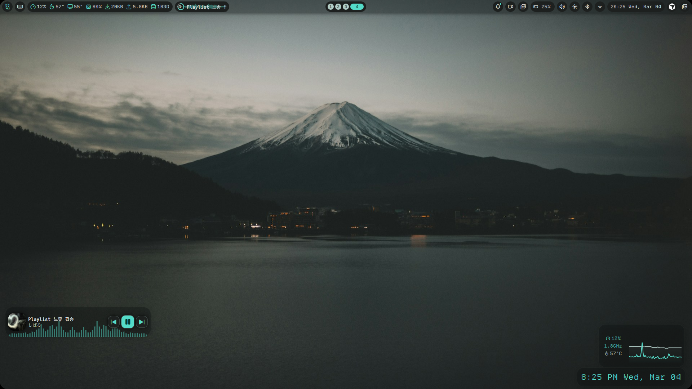
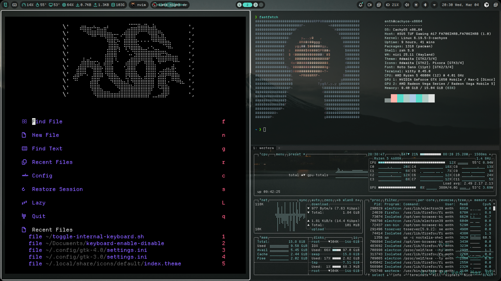

## niri-dots

Personal dotfiles for my Linux desktop, centered around the **niri** Wayland compositor.  
This repo collects my window manager, terminal, editor, theme, and shell configs in one place so you can quickly see how everything fits together and reuse anything you like.

### Overview

- **Distro**: CachyOS (Arch-based)
- **Compositor**: `niri` (`niri/config.kdl`)
- **Terminal**: `wezterm` (`wezterm/wezterm.lua`)
- **Editor**: `neovim` (all files under `nvim/`)
- **Shell**: `zsh` (`.zshrc`)
- **Theme / Colors**: `noctalia` configs (`noctalia/*.json`)
- **Scripts**: helper scripts in `scripts/`

### Repository layout

- **`niri/config.kdl`**: Main tiling layout, keybindings, and appearance for the niri compositor.
- **`wezterm/wezterm.lua`**: Terminal font, colors, keybindings, and window behavior.
- **`nvim/`**:
  - `nvim/init.lua` and `nvim/lua/config/*`: Core editor settings, keymaps, and autocommands.
  - `nvim/lua/plugins/*`: Plugin specs and configuration (LSP, Treesitter, UI, telescope, etc.).
- **`noctalia/`**: Color and theme configuration shared across apps (where applicable).
- **`.zshrc`**: Shell aliases, prompts, environment variables.
- **`scripts/`**: Small helper scripts like `toggle-internal-keyboard.sh`.
- **`images/`**: Screenshots of the desktop (you add these).

### Desktop screenshots

Current screenshots:

### Niri keybinds

These are the most important keybinds from `niri/config.kdl`. `Mod` is your main modifier key (usually `Super` / `Win`).

#### Launcher & apps

| Keys                    | Action                                               |
|-------------------------|------------------------------------------------------|
| `Mod + F1`              | Toggle keybind cheatsheet (Noctalia overlay)        |
| `Mod + Return`          | Open `kitty` terminal                               |
| `Mod + Shift + D`       | Launch app launcher (`fuzzel`)                      |
| `Mod + Space`           | Toggle Noctalia launcher                            |
| `Mod + Shift + ,`       | Open Noctalia settings                              |
| `Mod + Alt + L`         | Lock screen via Noctalia                            |
| `Mod + Ctrl + P`        | Lock and suspend                                    |
| `Mod + X`               | Open session menu                                   |
| `Mod + N`               | Open `kitty` with `nvim`                            |
| `Mod + Shift + N`       | Open VS Code (`code-oss --new-window`)              |
| `Mod + E`               | File manager (`yazi` in `kitty`)                    |
| `Mod + B`               | Open `zen-browser`                                  |
| `Mod + Shift + B`       | Open `firefox`                                      |
| `Mod + Shift + P`       | Open `firefox` private window                       |

#### System controls

| Keys                                          | Action                                      |
|-----------------------------------------------|---------------------------------------------|
| `XF86AudioRaiseVolume / LowerVolume / Mute`   | Control audio volume/mute (works when locked) |
| `XF86AudioMicMute`                            | Toggle microphone mute (works when locked)  |
| `XF86MonBrightnessUp / Down`                  | Adjust screen brightness                    |
| `Mod + Alt + S`                               | Toggle screen reader (`orca`)               |
| `Mod + Alt + P`                               | Power off monitors                          |
| `Mod + Escape`                                | Toggle keyboard shortcut inhibitor          |
| `Mod + Shift + E` / `Ctrl + Alt + Delete`     | Quit niri                                   |

#### Window & workspace management

| Keys                                           | Action                                   |
|------------------------------------------------|------------------------------------------|
| `Mod + O`                                      | Toggle overview                          |
| `Mod + Q`                                      | Close focused window                     |
| `Mod + Left / Right` or `Mod + H / L`          | Focus column left/right                  |
| `Mod + Up / Down`                              | Focus window up/down                     |
| `Mod + J / K`                                  | Focus workspace down/up                  |
| `Mod + Ctrl + Left / Right` or `Mod + Ctrl + H / L` | Move column left/right              |
| `Mod + Ctrl + Up / Down` or `Mod + Ctrl + J / K`    | Move window up/down                  |
| `Mod + Shift + Arrow` or `Mod + Shift + H/J/K/L`    | Focus monitor in that direction     |
| `Mod + Shift + Ctrl + Arrow` or `Mod + Shift + Ctrl + H/J/K/L` | Move column to monitor in that direction |
| `Mod + PageUp / PageDown` or `Mod + K / J`     | Focus workspace up/down                  |
| `Mod + Ctrl + PageUp / PageDown` or `Mod + Ctrl + I / U` | Move column to workspace up/down  |
| `Mod + Shift + PageUp / PageDown` or `Mod + Shift + I / U` | Move workspace up/down          |
| `Mod + 1..9`                                   | Focus workspace 1–9                      |
| `Mod + Shift + 1..9`                           | Move column to workspace 1–9             |

#### Layout & sizing

| Keys                                  | Action                                      |
|---------------------------------------|---------------------------------------------|
| `Mod + Home / End`                    | Focus first/last column                     |
| `Mod + Ctrl + Home / End`            | Move column to first/last position          |
| `Mod + R`                             | Cycle column width presets                  |
| `Mod + Shift + R`                     | Cycle window height presets                 |
| `Mod + Ctrl + R`                      | Reset window height                         |
| `Mod + Minus / Equal`                 | Shrink / grow column width                  |
| `Mod + Shift + Minus / Equal`         | Shrink / grow window height                 |
| `Mod + V`                             | Toggle window floating                      |
| `Mod + Shift + V`                     | Switch focus between floating and tiling    |
| `Mod + W`                             | Toggle tabbed column display                |
| `Mod + F`                             | Maximize column                             |
| `Mod + Shift + F`                     | Fullscreen window                           |
| `Mod + Ctrl + F`                      | Expand column to available width            |
| `Mod + C`                             | Center column                               |
| `Mod + Ctrl + C`                      | Center all visible columns                  |
| `Mod + [` / `Mod + ]`                 | Consume/expel window left/right             |
| `Mod + ,` / `Mod + .`                 | Consume into / expel from column            |

#### Screenshots

| Keys               | Action                    |
|--------------------|---------------------------|
| `Mod + Shift + S`  | Screenshot focused window |
| `Ctrl + Print`     | Screenshot screen         |
| `Alt + Print`      | Screenshot area           |

### How to use these dotfiles

- **Browse / copy pieces**: The easiest way is to open specific config files and copy the parts you like into your own setup.
- **Symlink into `$HOME`** (advanced): You can clone this repo and symlink the configs into your home directory (e.g., `~/.config/niri`, `~/.config/wezterm`, `~/.config/nvim`, etc.). Make sure to back up your existing configs first.

This repo is meant as a reference for my personal setup, but you’re welcome to adapt it to your own workflow.
